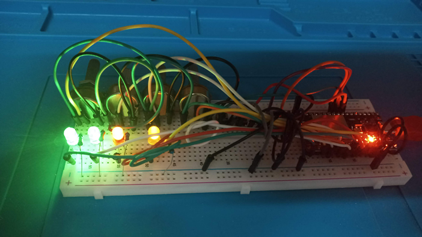

# ESP32 en Vscode

:pushpin: Trabajo Colaborativo 2                                                     24/04 - 30/04

·        Se debe desarrollar un web server con el esp32, de manera de poder acceder a el desde el celular y poder ver los siguientes parámetros:

4 Entradas Analógicas

4 Entradas Digitales

·        Además, poder actuar sobre

4 Salidas Digitales

·        Todo esto se debe implementar sobre un dashboard acorde definido por el PO.

·        Este desarrollo debe quedar plasmado en el repositorio generado.

# Proyecto Terminado

