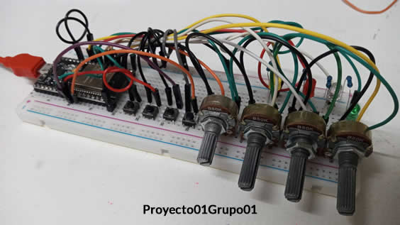

# ESP32 en Vscode

:pushpin: En esta sección se trabajará sobre el código a subir y ejecutar en el microcontrolador. Aquí se trabaja sobre el dispositivo fisico, y se hacen ensayos de prueba y error 

